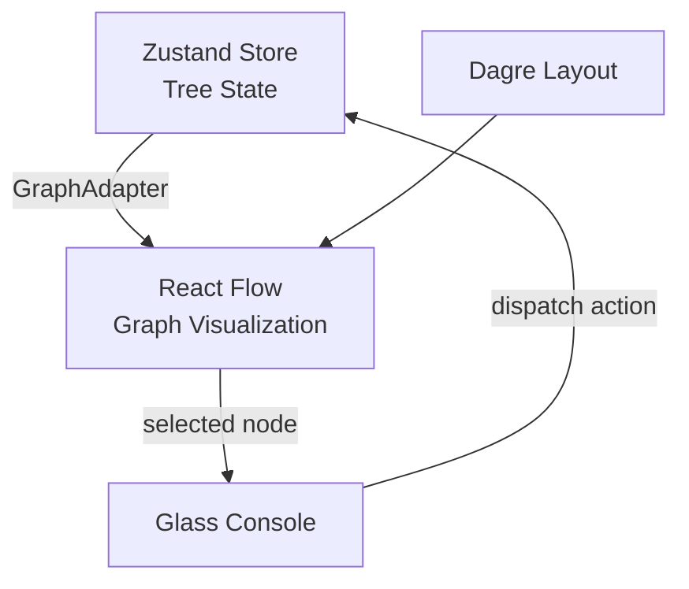

# Spectra - PRD & Technical Implementation Plan

> **24-Hour Hackathon Scope** — Focus on Phase 1 & 2 only. Keep it lean.

---

## 1. Product Overview

**Spectra** is a spatial AI workspace that visualizes LLM conversations as a **Tree of Thoughts** graph. The core philosophy: *"The Graph IS the Chat"* — no linear sidebars, just an infinite canvas where ideas branch and grow.

### Target Users
Developers, researchers, visual thinkers, students, and brainstormers who want non-linear exploration of AI conversations.

### Core Value Proposition
- **Branching Conversations:** Fork any message into alternate exploration paths
- **Spatial Context:** See the full conversation structure at a glance
- **Semantic Zoom:** Navigate from bird's-eye overview to deep immersion

---

## 2. Design System: "Immersive Ethereal"

| Element | Specification |
|---------|---------------|
| **Layout** | Full-screen canvas (100vw × 100vh) |
| **Background** | Fixed Aurora Gradient (mesh: white → pale blue → soft violet) |
| **Glass Console** | Bottom-center floating input: `bg-white/60`, `backdrop-blur-xl`, `rounded-2xl`, broad shadow |
| **Nodes** | Glassmorphism cards with `bg-white/50`, `backdrop-blur-md`, subtle borders |

---

## 3. Technical Architecture



### Stack
- **Framework:** React 18 + Vite + TypeScript
- **Styling:** Tailwind CSS v3
- **State:** Zustand + persist middleware
- **Graph:** React Flow + Dagre layout
- **AI:** Google Gemini Flash 1.5 (Phase 3)

---

## 4. File Structure

```
src/
├── main.tsx                    # App entry point
├── App.tsx                     # Root component
├── index.css                   # Tailwind directives + Aurora gradient
│
├── components/
│   ├── Canvas/
│   │   └── GraphCanvas.tsx     # React Flow wrapper (full-screen)
│   ├── Console/
│   │   └── GlassConsole.tsx    # Floating input panel
│   └── Nodes/
│       ├── BaseNode.tsx        # Shared glassmorphism wrapper
│       ├── DotNode.tsx         # Zoom Level 0 (small circle)
│       ├── LabelNode.tsx       # Zoom Level 1 (dot + topic label)
│       ├── PreviewNode.tsx     # Zoom Level 2 (2-line excerpt)
│       └── FullNode.tsx        # Zoom Level 3 (full content)
│
├── store/
│   ├── useTreeStore.ts         # Zustand store (tree data + actions)
│   └── selectors.ts            # Derived state selectors
│
├── adapters/
│   └── graphAdapter.ts         # Tree → React Flow elements
│
├── services/
│   └── ai/
│       └── geminiService.ts    # Gemini API integration (Phase 3)
│
├── hooks/
│   ├── useZoomLevel.ts         # Returns current semantic zoom level (0-3)
│   └── useFocusBranch.ts       # Returns active branch node IDs
│
├── utils/
│   ├── treeUtils.ts            # Tree traversal helpers
│   └── layoutUtils.ts          # Dagre layout configuration
│
└── types/
    └── index.ts                # All TypeScript interfaces
```

---

## 5. State Schema

### TypeScript Interfaces

```typescript
// types/index.ts

export type NodeStatus = 'idle' | 'streaming' | 'error';

/** Core tree node stored in Zustand */
export interface TreeNode {
  id: string;
  parentId: string | null;
  role: 'user' | 'assistant' | 'system';
  content: string;
  label?: string;              // Auto-generated summary (Phase 3)
  status: NodeStatus;          // AI streaming state
  tokenCount: number;          // Token usage tracking
  createdAt: number;
  children: string[];          // Child node IDs (ordered)
}

/** Zustand store state */
export interface TreeState {
  nodes: Record<string, TreeNode>;  // Flat map for O(1) lookup
  rootId: string | null;
  selectedNodeId: string | null;

  // Actions
  addNode: (parentId: string | null, role: TreeNode['role'], content: string) => string;
  selectNode: (nodeId: string) => void;
  deleteNode: (nodeId: string) => void;
  updateNodeContent: (nodeId: string, content: string) => void;
  setNodeStatus: (nodeId: string, status: NodeStatus) => void;
}

/** React Flow node (derived via adapter) */
export interface GraphNode {
  id: string;
  type: 'dot' | 'label' | 'preview' | 'full';
  position: { x: number; y: number };
  data: {
    treeNode: TreeNode;
    isOnActiveBranch: boolean;
    depth: number;
  };
}

/** React Flow edge (derived via adapter) */
export interface GraphEdge {
  id: string;
  source: string;
  target: string;
  animated?: boolean;
  style?: React.CSSProperties;
}

/** Zoom-level dimensions for dagre layout */
export const ZOOM_DIMENSIONS: Record<0 | 1 | 2 | 3, { w: number; h: number }> = {
  0: { w: 20, h: 20 },    // Dot
  1: { w: 100, h: 40 },   // Label
  2: { w: 200, h: 80 },   // Preview
  3: { w: 400, h: 500 },  // Full (tall for text)
};
```

---

## 6. Graph Adapter Logic

The adapter transforms the flat tree state into React Flow elements.

```typescript
// adapters/graphAdapter.ts

import dagre from 'dagre';
import { TreeNode, GraphNode, GraphEdge, TreeState, ZOOM_DIMENSIONS } from '../types';

export function treeToReactFlow(
  state: TreeState,
  zoomLevel: 0 | 1 | 2 | 3,
  activeBranchIds: Set<string>
): { nodes: GraphNode[]; edges: GraphEdge[] } {
  const { nodes: treeNodes, rootId } = state;
  if (!rootId) return { nodes: [], edges: [] };

  // Get dimensions for current zoom level
  const { w: NODE_WIDTH, h: NODE_HEIGHT } = ZOOM_DIMENSIONS[zoomLevel];

  // 1. Build dagre graph for layout
  const g = new dagre.graphlib.Graph();
  g.setGraph({ rankdir: 'TB', nodesep: 50, ranksep: 100 });
  g.setDefaultEdgeLabel(() => ({}));

  // 2. Add all nodes with zoom-aware dimensions
  Object.values(treeNodes).forEach((node) => {
    g.setNode(node.id, { width: NODE_WIDTH, height: NODE_HEIGHT });
  });

  // 3. Add all edges to dagre
  const edges: GraphEdge[] = [];
  Object.values(treeNodes).forEach((node) => {
    node.children.forEach((childId) => {
      g.setEdge(node.id, childId);
      edges.push({
        id: `${node.id}-${childId}`,
        source: node.id,
        target: childId,
        style: {
          opacity: activeBranchIds.has(node.id) && activeBranchIds.has(childId) ? 1 : 0.2,
        },
      });
    });
  });

  // 4. Run dagre layout
  dagre.layout(g);

  // 5. Map to React Flow nodes
  const nodeTypeMap = ['dot', 'label', 'preview', 'full'] as const;
  const graphNodes: GraphNode[] = Object.values(treeNodes).map((treeNode) => {
    const pos = g.node(treeNode.id);
    return {
      id: treeNode.id,
      type: nodeTypeMap[zoomLevel],
      position: { x: pos.x - NODE_WIDTH / 2, y: pos.y - NODE_HEIGHT / 2 },
      data: {
        treeNode,
        isOnActiveBranch: activeBranchIds.has(treeNode.id),
        depth: getDepth(treeNodes, treeNode.id),
      },
    };
  });

  return { nodes: graphNodes, edges };
}

function getDepth(nodes: Record<string, TreeNode>, nodeId: string): number {
  let depth = 0;
  let current = nodes[nodeId];
  while (current?.parentId) {
    depth++;
    current = nodes[current.parentId];
  }
  return depth;
}
```

---

## 7. Implementation Checklist

### Phase 1: Core Foundation (~4-6 hours)

| # | Task | Details |
|---|------|---------|
| 1.1 | **Project Setup** | `npm create vite@latest . -- --template react-ts` |
| 1.2 | **Install Dependencies** | `npm i reactflow zustand dagre @types/dagre tailwindcss postcss autoprefixer` |
| 1.3 | **Configure Tailwind** | `npx tailwindcss init -p`, add directives to `index.css` |
| 1.4 | **Create File Structure** | Scaffold all directories and empty files as per §4 |
| 1.5 | **Build Types** | Implement `types/index.ts` with all interfaces |
| 1.6 | **Build Zustand Store** | Implement `useTreeStore.ts` with `addNode`, `selectNode`, `deleteNode` |
| 1.7 | **Build Graph Adapter** | Implement `graphAdapter.ts` (simplified - no zoom level yet) |
| 1.8 | **Build GraphCanvas** | Full-screen React Flow instance with Aurora background |
| 1.9 | **Build GlassConsole** | Floating glassmorphism input at bottom-center |
| 1.10 | **Wire Console → Store** | Typing + Enter adds child node to selected node |
| 1.11 | **Verify Basic Flow** | Can add nodes, see them appear on graph, selection works |

### Phase 2: Semantic Zoom & Focus (~4-6 hours)

| # | Task | Details |
|---|------|---------|
| 2.1 | **Build useZoomLevel Hook** | Map viewport zoom → semantic level (0-3) |
| 2.2 | **Build Custom Node Components** | `DotNode`, `LabelNode`, `PreviewNode`, `FullNode` |
| 2.3 | **Dynamic Node Type** | GraphAdapter returns correct type based on zoom level |
| 2.4 | **Build useFocusBranch Hook** | Returns `Set<string>` of IDs from root → selected node |
| 2.5 | **Focus Mode Opacity** | Apply 20% opacity to nodes/edges not in active branch |
| 2.6 | **Polish Transitions** | Smooth CSS transitions for opacity and node size changes |
| 2.7 | **Integration Test** | Full interaction: zoom in/out, click to focus, type to branch |

### Phase 3: Intelligence (Time Permitting)

| # | Task | Details |
|---|------|---------|
| 3.1 | **Gemini Service** | Implement `geminiService.ts` with streaming support |
| 3.2 | **Integrate Streaming** | Wire `addNode` to trigger Gemini response with live updates |
| 3.3 | **Auto-Labeling** | Generate summary labels for Level 1 nodes when branch depth > 3 |

---

## 8. Verification Plan

### Automated Tests
> *Skipped for hackathon* — 24h constraint. Core verification is manual.

### Manual Verification

#### Phase 1 Verification
1. **Start dev server:** `npm run dev`
2. **Empty State:** Canvas shows Aurora gradient, no nodes, console is visible
3. **Add Root Node:** Type in console, press Enter → first node appears at top of graph
4. **Add Child Nodes:** Select node, type → child appears below with connecting edge
5. **Selection:** Click different nodes → selection indicator updates
6. **Persistence:** Refresh page → state persists (Zustand persist middleware)

#### Phase 2 Verification
1. **Zoom Out (Mouse wheel):** Nodes shrink to dots
2. **Zoom In:** Nodes expand to show full content
3. **Semantic Levels:** Verify 4 distinct visual states at different zoom thresholds
4. **Focus Mode:** Click a deep node → ancestor path is bright, siblings are dimmed
5. **Console Context:** Console shows which node you're replying to

---

## Proposed Changes

### [NEW] Project Root Configuration

#### [NEW] [vite.config.ts](file:///Users/zeitler/Desktop/code/project-spectra/vite.config.ts)
Standard Vite config with React plugin.

#### [NEW] [tailwind.config.js](file:///Users/zeitler/Desktop/code/project-spectra/tailwind.config.js)
Tailwind config with content paths and any custom theme extensions.

#### [NEW] [postcss.config.js](file:///Users/zeitler/Desktop/code/project-spectra/postcss.config.js)
PostCSS config for Tailwind.

---

### [NEW] Source Files

#### [NEW] [index.css](file:///Users/zeitler/Desktop/code/project-spectra/src/index.css)
Tailwind directives + Aurora gradient background styles.

#### [NEW] [types/index.ts](file:///Users/zeitler/Desktop/code/project-spectra/src/types/index.ts)
All TypeScript interfaces: `TreeNode`, `TreeState`, `GraphNode`, `GraphEdge`.

#### [NEW] [store/useTreeStore.ts](file:///Users/zeitler/Desktop/code/project-spectra/src/store/useTreeStore.ts)
Zustand store with tree state and actions.

#### [NEW] [adapters/graphAdapter.ts](file:///Users/zeitler/Desktop/code/project-spectra/src/adapters/graphAdapter.ts)
Tree → React Flow transformation with dagre layout.

#### [NEW] [components/Canvas/GraphCanvas.tsx](file:///Users/zeitler/Desktop/code/project-spectra/src/components/Canvas/GraphCanvas.tsx)
Full-screen React Flow wrapper.

#### [NEW] [components/Console/GlassConsole.tsx](file:///Users/zeitler/Desktop/code/project-spectra/src/components/Console/GlassConsole.tsx)
Glassmorphism floating input panel.

#### [NEW] [components/Nodes/*.tsx](file:///Users/zeitler/Desktop/code/project-spectra/src/components/Nodes/)
Custom node components for each zoom level.

#### [NEW] [hooks/useZoomLevel.ts](file:///Users/zeitler/Desktop/code/project-spectra/src/hooks/useZoomLevel.ts)
Maps viewport zoom to semantic level (0-3).

#### [NEW] [hooks/useFocusBranch.ts](file:///Users/zeitler/Desktop/code/project-spectra/src/hooks/useFocusBranch.ts)
Computes active branch node IDs.

#### [NEW] [services/ai/geminiService.ts](file:///Users/zeitler/Desktop/code/project-spectra/src/services/ai/geminiService.ts)
Gemini Flash 1.5 streaming integration (placeholder for Phase 3).

---

> [!IMPORTANT]
> **Phase 3 is scaffolded but not implemented.** The `TreeNode` schema includes `status` and `tokenCount` fields, and `geminiService.ts` exists as a placeholder to avoid refactoring later.
